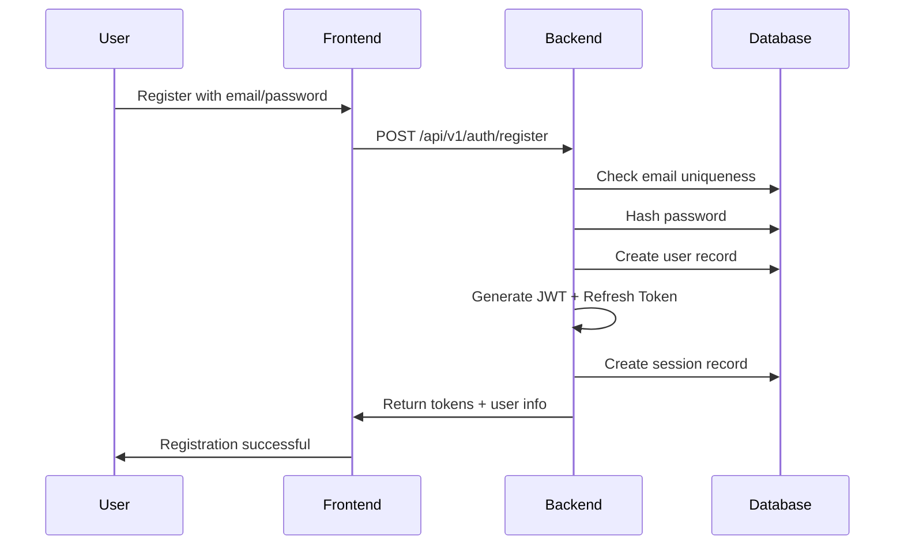
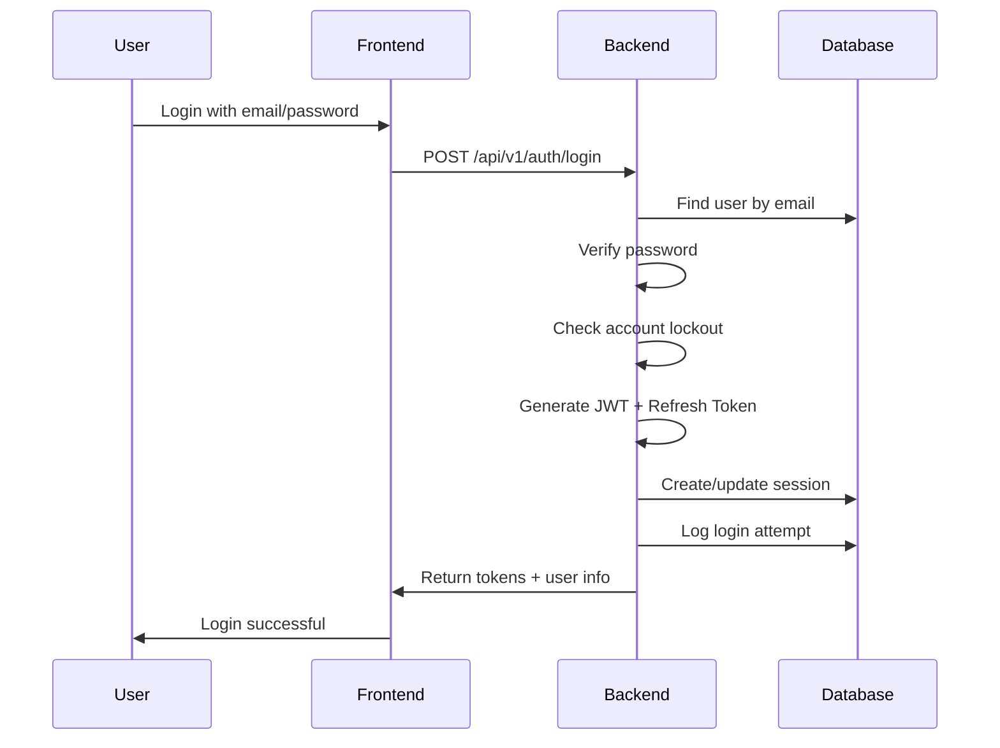

# Authentication & Authorization

Complete guide to the multi-tenant authentication and authorization system.

## Overview

The Liyali Gateway Backend implements a comprehensive authentication and authorization system with:

- **Multi-tenant Architecture** - Complete organization isolation
- **JWT + Session Management** - Secure token-based authentication
- **Advanced RBAC** - 50+ granular permissions with custom roles
- **Account Security** - Lockout protection, password policies, audit logging
- **Session Management** - Multiple concurrent sessions with timeout

## Authentication Flow

### Registration Flow



### Login Flow



## API Endpoints

### Authentication Endpoints

#### Register User
```http
POST /api/v1/auth/register
Content-Type: application/json

{
  "email": "user@company.com",
  "password": "SecurePassword123!",
  "name": "John Doe",
  "organizationId": "org-uuid"
}
```

**Response:**
```json
{
  "success": true,
  "data": {
    "user": {
      "id": "user-uuid",
      "email": "user@company.com",
      "name": "John Doe",
      "organizationId": "org-uuid",
      "roles": ["user"]
    },
    "tokens": {
      "accessToken": "jwt-token",
      "refreshToken": "refresh-token",
      "expiresIn": 86400
    }
  }
}
```

#### Login
```http
POST /api/v1/auth/login
Content-Type: application/json

{
  "email": "user@company.com",
  "password": "SecurePassword123!"
}
```

#### Refresh Token
```http
POST /api/v1/auth/refresh
Content-Type: application/json

{
  "refreshToken": "refresh-token"
}
```

#### Logout
```http
POST /api/v1/auth/logout
Authorization: Bearer jwt-token
```

#### Password Reset
```http
POST /api/v1/auth/forgot-password
Content-Type: application/json

{
  "email": "user@company.com"
}
```

```http
POST /api/v1/auth/reset-password
Content-Type: application/json

{
  "token": "reset-token",
  "newPassword": "NewSecurePassword123!"
}
```

### Session Management

#### Get Active Sessions
```http
GET /api/v1/auth/sessions
Authorization: Bearer jwt-token
```

#### Revoke Session
```http
DELETE /api/v1/auth/sessions/{sessionId}
Authorization: Bearer jwt-token
```

#### Revoke All Sessions
```http
DELETE /api/v1/auth/sessions
Authorization: Bearer jwt-token
```

## Authorization System

### Role-Based Access Control (RBAC)

The system implements a flexible RBAC system with:

#### Built-in Roles
- **super_admin** - System-wide administration
- **org_admin** - Organization administration
- **manager** - Department management
- **user** - Basic user access
- **viewer** - Read-only access

#### Custom Roles
Organizations can create custom roles with specific permission combinations.

### Permissions System

#### Document Permissions
```go
// Document-level permissions
"documents.create"
"documents.read"
"documents.update"
"documents.delete"
"documents.approve"
"documents.reject"
```

#### Requisition Permissions
```go
// Requisition-specific permissions
"requisitions.create"
"requisitions.read"
"requisitions.update"
"requisitions.delete"
"requisitions.approve"
"requisitions.reject"
"requisitions.submit"
"requisitions.cancel"
```

#### Budget Permissions
```go
// Budget management permissions
"budgets.create"
"budgets.read"
"budgets.update"
"budgets.delete"
"budgets.allocate"
"budgets.transfer"
```

#### Administrative Permissions
```go
// Organization management
"organizations.manage"
"users.manage"
"roles.manage"
"permissions.manage"

// System administration
"system.admin"
"audit.read"
"reports.generate"
```

### Permission Checking

#### Middleware-based Authorization
```go
// Protect routes with permissions
router.Get("/api/v1/requisitions", 
    middleware.RequireAuth(),
    middleware.RequirePermission("requisitions.read"),
    handlers.GetRequisitions)
```

#### Service-level Authorization
```go
// Check permissions in services
func (s *RequisitionService) GetRequisition(userID, reqID string) (*Requisition, error) {
    if !s.authService.HasPermission(userID, "requisitions.read") {
        return nil, ErrUnauthorized
    }
    // ... business logic
}
```

## Multi-Tenancy

### Organization Isolation

Every request is scoped to the user's organization:

```go
// Automatic organization filtering
func (r *RequisitionRepository) GetByID(orgID, reqID string) (*Requisition, error) {
    var req Requisition
    err := r.db.Where("organization_id = ? AND id = ?", orgID, reqID).First(&req).Error
    return &req, err
}
```

### Cross-Organization Access

Super admins can access multiple organizations:

```go
// Super admin access
func (s *UserService) GetUser(requestorID, targetUserID string) (*User, error) {
    requestor, _ := s.GetByID(requestorID)
    
    if requestor.HasRole("super_admin") {
        // Can access any user
        return s.repo.GetByID(targetUserID)
    }
    
    // Regular users can only access same organization
    return s.repo.GetByIDAndOrg(targetUserID, requestor.OrganizationID)
}
```

## Security Features

### Password Security

#### Password Policy
- Minimum 8 characters
- Must contain uppercase letter
- Must contain lowercase letter
- Must contain number
- Must contain special character

#### Password Hashing
```go
// Using bcrypt with cost 12
func HashPassword(password string) (string, error) {
    bytes, err := bcrypt.GenerateFromPassword([]byte(password), 12)
    return string(bytes), err
}
```

### Account Lockout

#### Lockout Policy
- Maximum 5 failed attempts
- 15-minute lockout duration
- Automatic unlock after timeout
- Manual unlock by admin

#### Implementation
```go
func (s *AuthService) Login(email, password string) (*LoginResponse, error) {
    user, err := s.userRepo.GetByEmail(email)
    if err != nil {
        return nil, err
    }
    
    // Check if account is locked
    if user.IsLocked() {
        return nil, ErrAccountLocked
    }
    
    // Verify password
    if !user.VerifyPassword(password) {
        user.IncrementFailedAttempts()
        s.userRepo.Update(user)
        return nil, ErrInvalidCredentials
    }
    
    // Reset failed attempts on successful login
    user.ResetFailedAttempts()
    s.userRepo.Update(user)
    
    // Generate tokens and create session
    return s.generateTokens(user)
}
```

### JWT Security

#### Token Configuration
```go
// JWT claims structure
type Claims struct {
    UserID         string   `json:"user_id"`
    OrganizationID string   `json:"organization_id"`
    Email          string   `json:"email"`
    Roles          []string `json:"roles"`
    Permissions    []string `json:"permissions"`
    SessionID      string   `json:"session_id"`
    jwt.RegisteredClaims
}
```

#### Token Validation
```go
func (s *AuthService) ValidateToken(tokenString string) (*Claims, error) {
    token, err := jwt.ParseWithClaims(tokenString, &Claims{}, func(token *jwt.Token) (interface{}, error) {
        return []byte(s.jwtSecret), nil
    })
    
    if err != nil {
        return nil, err
    }
    
    claims, ok := token.Claims.(*Claims)
    if !ok || !token.Valid {
        return nil, ErrInvalidToken
    }
    
    // Check if session is still active
    if !s.sessionRepo.IsActive(claims.SessionID) {
        return nil, ErrSessionExpired
    }
    
    return claims, nil
}
```

### Session Management

#### Session Model
```go
type Session struct {
    ID           string    `json:"id" gorm:"primaryKey"`
    UserID       string    `json:"userId" gorm:"not null"`
    DeviceInfo   string    `json:"deviceInfo"`
    IPAddress    string    `json:"ipAddress"`
    UserAgent    string    `json:"userAgent"`
    IsActive     bool      `json:"isActive" gorm:"default:true"`
    LastActivity time.Time `json:"lastActivity"`
    ExpiresAt    time.Time `json:"expiresAt"`
    CreatedAt    time.Time `json:"createdAt"`
}
```

#### Session Cleanup
```go
// Automatic session cleanup
func (s *SessionService) CleanupExpiredSessions() {
    s.repo.DeleteExpired()
}

// Limit concurrent sessions per user
func (s *SessionService) CreateSession(userID string) (*Session, error) {
    activeSessions := s.repo.GetActiveByUserID(userID)
    
    if len(activeSessions) >= s.maxSessionsPerUser {
        // Revoke oldest session
        s.repo.RevokeSession(activeSessions[0].ID)
    }
    
    return s.repo.Create(&Session{
        UserID:       userID,
        IsActive:     true,
        LastActivity: time.Now(),
        ExpiresAt:    time.Now().Add(s.sessionTimeout),
    })
}
```

## Audit Logging

### Audit Events

The system logs all authentication and authorization events:

```go
type AuditLog struct {
    ID             string    `json:"id" gorm:"primaryKey"`
    UserID         string    `json:"userId"`
    OrganizationID string    `json:"organizationId"`
    Action         string    `json:"action"`
    Resource       string    `json:"resource"`
    ResourceID     string    `json:"resourceId"`
    IPAddress      string    `json:"ipAddress"`
    UserAgent      string    `json:"userAgent"`
    Success        bool      `json:"success"`
    ErrorMessage   string    `json:"errorMessage,omitempty"`
    Metadata       string    `json:"metadata,omitempty"`
    Timestamp      time.Time `json:"timestamp"`
}
```

### Logged Events
- User registration
- Login attempts (success/failure)
- Password changes
- Password reset requests
- Session creation/revocation
- Permission checks
- Role assignments
- Organization changes

## Implementation Examples

### Protecting Routes

```go
// Require authentication
router.Use(middleware.RequireAuth())

// Require specific permission
router.Get("/requisitions", 
    middleware.RequirePermission("requisitions.read"),
    handlers.GetRequisitions)

// Require role
router.Get("/admin/users",
    middleware.RequireRole("org_admin"),
    handlers.GetUsers)

// Multiple permissions (OR logic)
router.Get("/documents",
    middleware.RequireAnyPermission("documents.read", "documents.admin"),
    handlers.GetDocuments)
```

### Service-Level Authorization

```go
func (s *RequisitionService) CreateRequisition(userID string, req *CreateRequisitionRequest) (*Requisition, error) {
    // Check permission
    if !s.authService.HasPermission(userID, "requisitions.create") {
        return nil, ErrUnauthorized
    }
    
    // Get user for organization context
    user, err := s.userService.GetByID(userID)
    if err != nil {
        return nil, err
    }
    
    // Create requisition in user's organization
    requisition := &Requisition{
        OrganizationID: user.OrganizationID,
        CreatedBy:      userID,
        // ... other fields
    }
    
    return s.repo.Create(requisition)
}
```

### Custom Permission Checks

```go
func (s *AuthService) CanAccessRequisition(userID, requisitionID string) bool {
    user, _ := s.userService.GetByID(userID)
    req, _ := s.requisitionService.GetByID(requisitionID)
    
    // Super admin can access anything
    if user.HasRole("super_admin") {
        return true
    }
    
    // Must be same organization
    if user.OrganizationID != req.OrganizationID {
        return false
    }
    
    // Check if user created the requisition
    if req.CreatedBy == userID {
        return s.HasPermission(userID, "requisitions.read")
    }
    
    // Check if user can read all requisitions
    return s.HasPermission(userID, "requisitions.read_all")
}
```

## Best Practices

### Security Best Practices

1. **Use HTTPS** in production
2. **Validate all inputs** before processing
3. **Implement rate limiting** on auth endpoints
4. **Log all security events** for audit
5. **Use strong JWT secrets** (minimum 32 characters)
6. **Implement proper session management**
7. **Regular security audits** of permissions

### Performance Best Practices

1. **Cache user permissions** to reduce database queries
2. **Use database indexes** on frequently queried fields
3. **Implement connection pooling** for database
4. **Monitor authentication performance**
5. **Clean up expired sessions** regularly

### Development Best Practices

1. **Test all permission combinations**
2. **Use middleware** for consistent authorization
3. **Document all permissions** and their usage
4. **Implement proper error handling**
5. **Use type-safe permission constants**

## Testing Authentication

### Unit Tests

```go
func TestLogin(t *testing.T) {
    // Test successful login
    response, err := authService.Login("user@test.com", "password")
    assert.NoError(t, err)
    assert.NotEmpty(t, response.AccessToken)
    
    // Test invalid credentials
    _, err = authService.Login("user@test.com", "wrong-password")
    assert.Error(t, err)
    
    // Test account lockout
    for i := 0; i < 6; i++ {
        authService.Login("user@test.com", "wrong-password")
    }
    _, err = authService.Login("user@test.com", "password")
    assert.Equal(t, ErrAccountLocked, err)
}
```

### Integration Tests

```go
func TestAuthenticationFlow(t *testing.T) {
    // Register user
    registerReq := &RegisterRequest{
        Email:          "test@example.com",
        Password:       "SecurePassword123!",
        Name:           "Test User",
        OrganizationID: testOrgID,
    }
    
    resp := httptest.NewRecorder()
    req := httptest.NewRequest("POST", "/api/v1/auth/register", 
        strings.NewReader(toJSON(registerReq)))
    
    router.ServeHTTP(resp, req)
    assert.Equal(t, 201, resp.Code)
    
    // Login with registered user
    loginReq := &LoginRequest{
        Email:    "test@example.com",
        Password: "SecurePassword123!",
    }
    
    resp = httptest.NewRecorder()
    req = httptest.NewRequest("POST", "/api/v1/auth/login",
        strings.NewReader(toJSON(loginReq)))
    
    router.ServeHTTP(resp, req)
    assert.Equal(t, 200, resp.Code)
}
```

## Troubleshooting

### Common Issues

**JWT Token Invalid**
- Check JWT secret configuration
- Verify token expiry
- Ensure session is still active

**Permission Denied**
- Verify user has required permissions
- Check organization context
- Confirm role assignments

**Account Locked**
- Check failed login attempts
- Verify lockout duration
- Manual unlock if needed

**Session Expired**
- Use refresh token to get new access token
- Check session timeout configuration
- Verify session cleanup process

For more troubleshooting, see [Troubleshooting Guide](./16-troubleshooting.md).

## Next Steps

- **Document Management**: Learn about [Document System](./08-documents.md)
- **Workflow Engine**: Understand [Approval Workflows](./09-workflows.md)
- **API Reference**: Explore [Complete API Documentation](./13-api-reference.md)
- **Testing**: Set up [Authentication Testing](./12-testing.md)