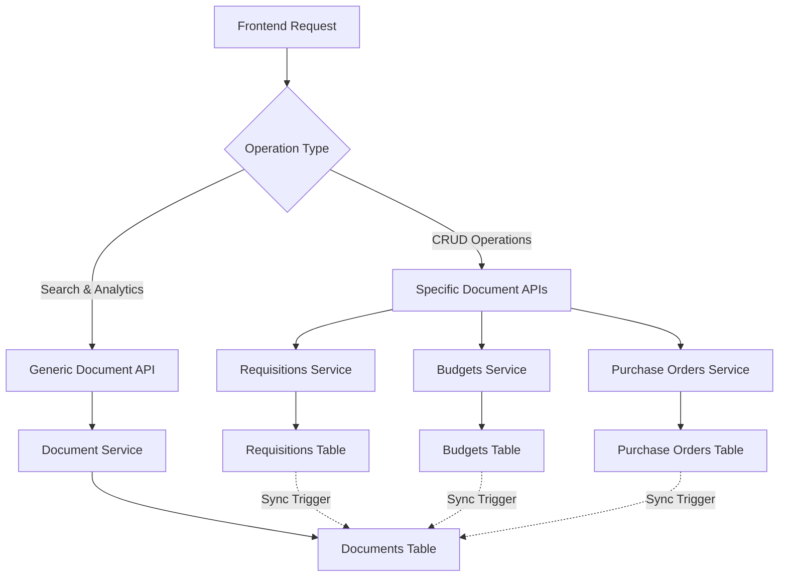
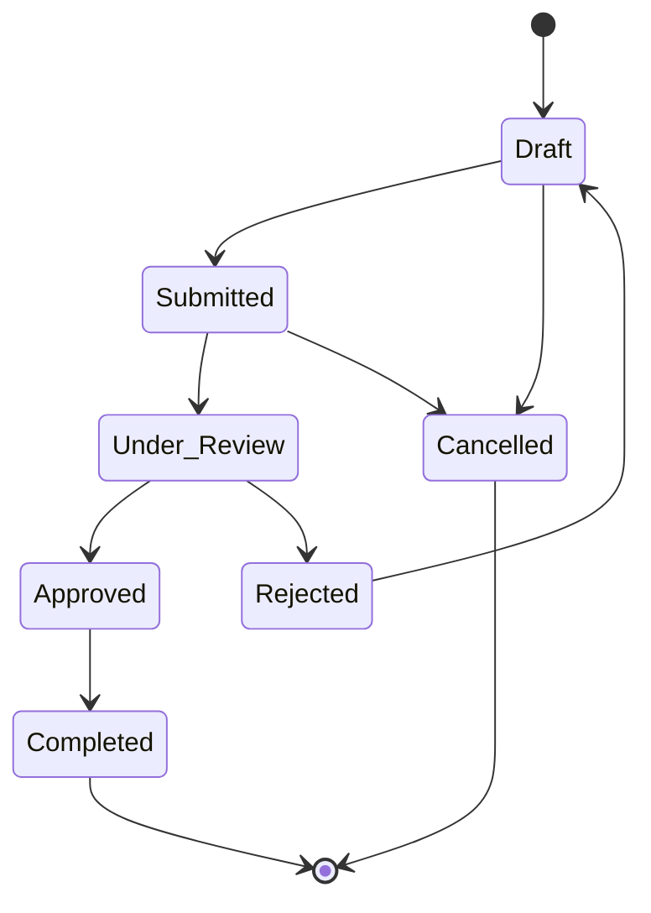

# Document Management System

Complete guide to the unified document management system with specific document types and generic operations.

## Overview

The Liyali Gateway Backend implements a dual-approach document management system:

- **Specific Document Models** - Type-safe operations with business logic
- **Generic Document System** - Unified search and cross-document operations
- **Automatic Synchronization** - Database triggers ensure data consistency
- **Multi-tenant Isolation** - Complete organization separation
- **Audit Trail** - Full document lifecycle tracking

## Architecture

### Dual Document Approach



### Data Synchronization

Database triggers automatically synchronize changes between specific document tables and the generic documents table:

```sql
-- Example sync trigger for requisitions
CREATE OR REPLACE FUNCTION sync_requisition_to_document()
RETURNS TRIGGER AS $$
BEGIN
    INSERT INTO documents (
        id, organization_id, document_type, document_number,
        title, description, status, total_amount, created_by,
        created_at, updated_at, type_specific_data
    ) VALUES (
        NEW.id, NEW.organization_id, 'requisition', NEW.document_number,
        NEW.title, NEW.description, NEW.status, NEW.total_amount,
        NEW.created_by, NEW.created_at, NEW.updated_at,
        row_to_json(NEW)
    )
    ON CONFLICT (id) DO UPDATE SET
        title = EXCLUDED.title,
        description = EXCLUDED.description,
        status = EXCLUDED.status,
        total_amount = EXCLUDED.total_amount,
        updated_at = EXCLUDED.updated_at,
        type_specific_data = EXCLUDED.type_specific_data;
    
    RETURN NEW;
END;
$$ LANGUAGE plpgsql;
```

## Document Types

### Supported Document Types

1. **Requisitions** - Purchase requests with approval workflow
2. **Budgets** - Budget allocation and tracking
3. **Purchase Orders** - Vendor purchase orders
4. **Payment Vouchers** - Payment processing documents
5. **Goods Received Notes** - Inventory receiving documents
6. **Categories** - Item categorization
7. **Vendors** - Supplier management

### Document Lifecycle



## Generic Document API

### Document Model

```go
type Document struct {
    ID               string                 `json:"id" gorm:"primaryKey"`
    OrganizationID   string                 `json:"organizationId" gorm:"not null;index"`
    DocumentType     string                 `json:"documentType" gorm:"not null;index"`
    DocumentNumber   string                 `json:"documentNumber" gorm:"not null;index"`
    Title            string                 `json:"title" gorm:"not null"`
    Description      string                 `json:"description"`
    Status           string                 `json:"status" gorm:"not null;index"`
    Priority         string                 `json:"priority" gorm:"default:'medium'"`
    TotalAmount      *float64               `json:"totalAmount,omitempty"`
    Currency         string                 `json:"currency" gorm:"default:'USD'"`
    CreatedBy        string                 `json:"createdBy" gorm:"not null"`
    AssignedTo       *string                `json:"assignedTo,omitempty"`
    DueDate          *time.Time             `json:"dueDate,omitempty"`
    CompletedAt      *time.Time             `json:"completedAt,omitempty"`
    Tags             pq.StringArray         `json:"tags" gorm:"type:text[]"`
    TypeSpecificData map[string]interface{} `json:"typeSpecificData" gorm:"type:jsonb"`
    CreatedAt        time.Time              `json:"createdAt"`
    UpdatedAt        time.Time              `json:"updatedAt"`
}
```

### Search Documents

#### Basic Search
```http
GET /api/v1/documents/search?q=laptop
Authorization: Bearer jwt-token
```

#### Advanced Search
```http
GET /api/v1/documents/search?q=laptop&type=requisition&status=approved&minAmount=1000&maxAmount=5000&page=1&limit=20
Authorization: Bearer jwt-token
```

**Query Parameters:**
- `q` - Search query (searches title, description, document number)
- `type` - Document type filter
- `status` - Status filter
- `priority` - Priority filter
- `createdBy` - Creator filter
- `assignedTo` - Assignee filter
- `minAmount` - Minimum amount filter
- `maxAmount` - Maximum amount filter
- `startDate` - Created after date
- `endDate` - Created before date
- `tags` - Tag filter (comma-separated)
- `page` - Page number (default: 1)
- `limit` - Items per page (default: 20, max: 100)

**Response:**
```json
{
  "success": true,
  "data": [
    {
      "id": "doc-uuid",
      "organizationId": "org-uuid",
      "documentType": "requisition",
      "documentNumber": "REQ-2024-001",
      "title": "Laptop Purchase Request",
      "description": "New laptops for development team",
      "status": "approved",
      "priority": "high",
      "totalAmount": 2400.00,
      "currency": "USD",
      "createdBy": "user-uuid",
      "assignedTo": "manager-uuid",
      "dueDate": "2024-01-15T00:00:00Z",
      "tags": ["IT", "hardware"],
      "typeSpecificData": {
        "department": "Engineering",
        "items": [
          {
            "name": "MacBook Pro",
            "quantity": 2,
            "unitPrice": 1200.00
          }
        ]
      },
      "createdAt": "2024-01-01T10:00:00Z",
      "updatedAt": "2024-01-02T14:30:00Z"
    }
  ],
  "pagination": {
    "page": 1,
    "total": 25,
    "totalPages": 3,
    "pageSize": 20,
    "hasNext": true,
    "hasPrev": false
  }
}
```

### Get Document by ID

```http
GET /api/v1/documents/{id}
Authorization: Bearer jwt-token
```

### Get Documents by Type

```http
GET /api/v1/documents/type/{documentType}?page=1&limit=20
Authorization: Bearer jwt-token
```

### Document Statistics

```http
GET /api/v1/documents/stats
Authorization: Bearer jwt-token
```

**Response:**
```json
{
  "success": true,
  "data": {
    "totalDocuments": 150,
    "documentsByType": {
      "requisition": 45,
      "budget": 20,
      "purchase_order": 35,
      "payment_voucher": 25,
      "grn": 15,
      "category": 8,
      "vendor": 2
    },
    "documentsByStatus": {
      "draft": 20,
      "submitted": 15,
      "under_review": 25,
      "approved": 60,
      "rejected": 10,
      "completed": 15,
      "cancelled": 5
    },
    "totalValue": 125000.00,
    "averageValue": 833.33
  }
}
```

## Specific Document APIs

### Requisitions API

#### Create Requisition
```http
POST /api/v1/requisitions
Authorization: Bearer jwt-token
Content-Type: application/json

{
  "title": "Office Supplies Request",
  "description": "Monthly office supplies order",
  "items": [
    {
      "name": "Laptop",
      "description": "MacBook Pro 16-inch",
      "quantity": 2,
      "unitPrice": 1200.00,
      "totalPrice": 2400.00,
      "category": "Electronics"
    }
  ],
  "totalAmount": 2400.00,
  "priority": "medium",
  "department": "IT",
  "justification": "Replacement for old laptops",
  "expectedDeliveryDate": "2024-02-01T00:00:00Z"
}
```

#### Get Requisitions
```http
GET /api/v1/requisitions?page=1&limit=20&status=pending
Authorization: Bearer jwt-token
```

#### Update Requisition
```http
PUT /api/v1/requisitions/{id}
Authorization: Bearer jwt-token
Content-Type: application/json

{
  "title": "Updated Office Supplies Request",
  "description": "Updated monthly office supplies order",
  "priority": "high"
}
```

#### Submit Requisition for Approval
```http
POST /api/v1/requisitions/{id}/submit
Authorization: Bearer jwt-token
```

### Budget API

#### Create Budget
```http
POST /api/v1/budgets
Authorization: Bearer jwt-token
Content-Type: application/json

{
  "name": "IT Department Budget 2024",
  "description": "Annual budget for IT department",
  "totalAmount": 100000.00,
  "allocatedAmount": 0.00,
  "spentAmount": 0.00,
  "fiscalYear": "2024",
  "department": "IT",
  "startDate": "2024-01-01T00:00:00Z",
  "endDate": "2024-12-31T23:59:59Z",
  "categories": [
    {
      "name": "Hardware",
      "allocatedAmount": 60000.00
    },
    {
      "name": "Software",
      "allocatedAmount": 40000.00
    }
  ]
}
```

### Purchase Order API

#### Create Purchase Order
```http
POST /api/v1/purchase-orders
Authorization: Bearer jwt-token
Content-Type: application/json

{
  "requisitionId": "req-uuid",
  "vendorId": "vendor-uuid",
  "title": "Laptop Purchase Order",
  "description": "Purchase order for approved laptop requisition",
  "items": [
    {
      "name": "MacBook Pro 16-inch",
      "quantity": 2,
      "unitPrice": 1200.00,
      "totalPrice": 2400.00
    }
  ],
  "totalAmount": 2400.00,
  "expectedDeliveryDate": "2024-02-01T00:00:00Z",
  "terms": "Net 30 days",
  "notes": "Deliver to main office"
}
```

## Document Operations

### Bulk Operations

#### Bulk Status Update
```http
PATCH /api/v1/documents/bulk/status
Authorization: Bearer jwt-token
Content-Type: application/json

{
  "documentIds": ["doc1-uuid", "doc2-uuid", "doc3-uuid"],
  "status": "approved",
  "comment": "Bulk approval for Q1 requisitions"
}
```

#### Bulk Assignment
```http
PATCH /api/v1/documents/bulk/assign
Authorization: Bearer jwt-token
Content-Type: application/json

{
  "documentIds": ["doc1-uuid", "doc2-uuid"],
  "assignedTo": "manager-uuid"
}
```

### Document Attachments

#### Upload Attachment
```http
POST /api/v1/documents/{id}/attachments
Authorization: Bearer jwt-token
Content-Type: multipart/form-data

file: [binary file data]
description: "Supporting documentation"
```

#### Get Attachments
```http
GET /api/v1/documents/{id}/attachments
Authorization: Bearer jwt-token
```

#### Download Attachment
```http
GET /api/v1/documents/{id}/attachments/{attachmentId}/download
Authorization: Bearer jwt-token
```

### Document Comments

#### Add Comment
```http
POST /api/v1/documents/{id}/comments
Authorization: Bearer jwt-token
Content-Type: application/json

{
  "content": "Please review the updated specifications",
  "isInternal": false
}
```

#### Get Comments
```http
GET /api/v1/documents/{id}/comments
Authorization: Bearer jwt-token
```

## Document Workflows

### Approval Workflows

Documents can be configured with approval workflows:

```go
type WorkflowStage struct {
    ID          string `json:"id"`
    Name        string `json:"name"`
    Order       int    `json:"order"`
    RequiredRole string `json:"requiredRole"`
    IsParallel  bool   `json:"isParallel"`
    IsOptional  bool   `json:"isOptional"`
}

type DocumentWorkflow struct {
    ID           string          `json:"id"`
    DocumentType string          `json:"documentType"`
    Name         string          `json:"name"`
    Description  string          `json:"description"`
    Stages       []WorkflowStage `json:"stages"`
    IsActive     bool            `json:"isActive"`
}
```

#### Start Workflow
```http
POST /api/v1/documents/{id}/workflow/start
Authorization: Bearer jwt-token
Content-Type: application/json

{
  "workflowId": "workflow-uuid",
  "comment": "Starting approval process"
}
```

#### Approve Stage
```http
POST /api/v1/documents/{id}/workflow/approve
Authorization: Bearer jwt-token
Content-Type: application/json

{
  "stageId": "stage-uuid",
  "comment": "Approved with minor modifications",
  "decision": "approved"
}
```

## Data Synchronization

### Sync Status

Check synchronization status between specific and generic documents:

```http
GET /api/v1/documents/sync/status
Authorization: Bearer jwt-token
```

**Response:**
```json
{
  "success": true,
  "data": {
    "lastSyncAt": "2024-01-01T12:00:00Z",
    "totalDocuments": 150,
    "syncedDocuments": 150,
    "pendingSync": 0,
    "syncErrors": 0,
    "syncHealth": "healthy"
  }
}
```

### Manual Sync

Force synchronization of specific documents:

```http
POST /api/v1/documents/sync/force
Authorization: Bearer jwt-token
Content-Type: application/json

{
  "documentType": "requisition",
  "documentIds": ["req1-uuid", "req2-uuid"]
}
```

## Performance Optimization

### Database Indexes

The system uses optimized database indexes for fast queries:

```sql
-- Generic documents table indexes
CREATE INDEX idx_documents_org_type ON documents(organization_id, document_type);
CREATE INDEX idx_documents_status ON documents(status);
CREATE INDEX idx_documents_created_by ON documents(created_by);
CREATE INDEX idx_documents_amount ON documents(total_amount);
CREATE INDEX idx_documents_created_at ON documents(created_at);
CREATE INDEX idx_documents_search ON documents USING gin(to_tsvector('english', title || ' ' || description));

-- Specific document table indexes
CREATE INDEX idx_requisitions_org_status ON requisitions(organization_id, status);
CREATE INDEX idx_budgets_org_year ON budgets(organization_id, fiscal_year);
CREATE INDEX idx_purchase_orders_vendor ON purchase_orders(vendor_id);
```

### Caching Strategy

The system implements multi-level caching:

1. **Application Cache** - Frequently accessed documents
2. **Query Cache** - Search results and filters
3. **Database Cache** - PostgreSQL query cache

### Search Optimization

Full-text search is optimized using PostgreSQL's built-in search capabilities:

```sql
-- Full-text search index
CREATE INDEX idx_documents_fts ON documents 
USING gin(to_tsvector('english', title || ' ' || description || ' ' || document_number));

-- Search query optimization
SELECT * FROM documents 
WHERE organization_id = $1 
  AND to_tsvector('english', title || ' ' || description || ' ' || document_number) 
      @@ plainto_tsquery('english', $2)
ORDER BY ts_rank(to_tsvector('english', title || ' ' || description), plainto_tsquery('english', $2)) DESC;
```

## Security & Permissions

### Document-Level Security

All document operations respect organization boundaries and user permissions:

```go
// Example permission check
func (s *DocumentService) GetDocument(userID, documentID string) (*Document, error) {
    user, err := s.userService.GetByID(userID)
    if err != nil {
        return nil, err
    }
    
    doc, err := s.repo.GetByID(documentID)
    if err != nil {
        return nil, err
    }
    
    // Check organization access
    if doc.OrganizationID != user.OrganizationID && !user.HasRole("super_admin") {
        return nil, ErrUnauthorized
    }
    
    // Check document-specific permissions
    if !s.authService.HasPermission(userID, "documents.read") {
        return nil, ErrUnauthorized
    }
    
    return doc, nil
}
```

### Field-Level Security

Sensitive fields can be filtered based on user permissions:

```go
func (s *DocumentService) FilterSensitiveFields(doc *Document, userID string) {
    if !s.authService.HasPermission(userID, "documents.read_financial") {
        doc.TotalAmount = nil
        doc.TypeSpecificData = filterFinancialData(doc.TypeSpecificData)
    }
}
```

## Testing

### Unit Tests

```go
func TestDocumentSearch(t *testing.T) {
    // Setup test data
    testDoc := &Document{
        Title:          "Test Laptop Request",
        Description:    "MacBook Pro for development",
        DocumentType:   "requisition",
        Status:         "approved",
        OrganizationID: testOrgID,
    }
    
    repo.Create(testDoc)
    
    // Test search
    results, err := service.SearchDocuments(testUserID, &SearchRequest{
        Query: "laptop",
        Type:  "requisition",
    })
    
    assert.NoError(t, err)
    assert.Len(t, results.Data, 1)
    assert.Equal(t, testDoc.ID, results.Data[0].ID)
}
```

### Integration Tests

```go
func TestDocumentSynchronization(t *testing.T) {
    // Create requisition
    req := &Requisition{
        Title:          "Test Requisition",
        Description:    "Test sync",
        OrganizationID: testOrgID,
    }
    
    createdReq, err := requisitionService.Create(testUserID, req)
    assert.NoError(t, err)
    
    // Verify sync to documents table
    time.Sleep(100 * time.Millisecond) // Allow trigger to execute
    
    doc, err := documentService.GetByID(testUserID, createdReq.ID)
    assert.NoError(t, err)
    assert.Equal(t, "requisition", doc.DocumentType)
    assert.Equal(t, req.Title, doc.Title)
}
```

## Best Practices

### When to Use Generic vs Specific APIs

**Use Generic Document API for:**
- Cross-document search and filtering
- Dashboard analytics and reporting
- Document listing and browsing
- Bulk operations across document types

**Use Specific Document APIs for:**
- Creating and editing documents
- Type-specific business logic
- Approval workflows
- Detailed document operations

### Performance Best Practices

1. **Use pagination** for large result sets
2. **Implement caching** for frequently accessed data
3. **Use database indexes** for search queries
4. **Limit search scope** with filters
5. **Monitor query performance** regularly

### Security Best Practices

1. **Always check permissions** before document access
2. **Validate organization context** for all operations
3. **Audit all document changes** for compliance
4. **Implement field-level security** for sensitive data
5. **Use HTTPS** for all document operations

## Troubleshooting

### Common Issues

**Document Not Found**
- Verify document exists in organization
- Check user permissions
- Confirm document ID format

**Search Not Working**
- Check full-text search indexes
- Verify search query format
- Test with simpler queries

**Sync Issues**
- Check trigger status
- Verify database permissions
- Review sync error logs

For detailed troubleshooting, see [Troubleshooting Guide](./16-troubleshooting.md).

## Next Steps

- **Workflow Engine**: Learn about [Approval Workflows](./09-workflows.md)
- **Search & Analytics**: Explore [Advanced Search](./10-search.md)
- **API Reference**: See [Complete API Documentation](./13-api-reference.md)
- **Testing**: Set up [Document Testing](./12-testing.md)