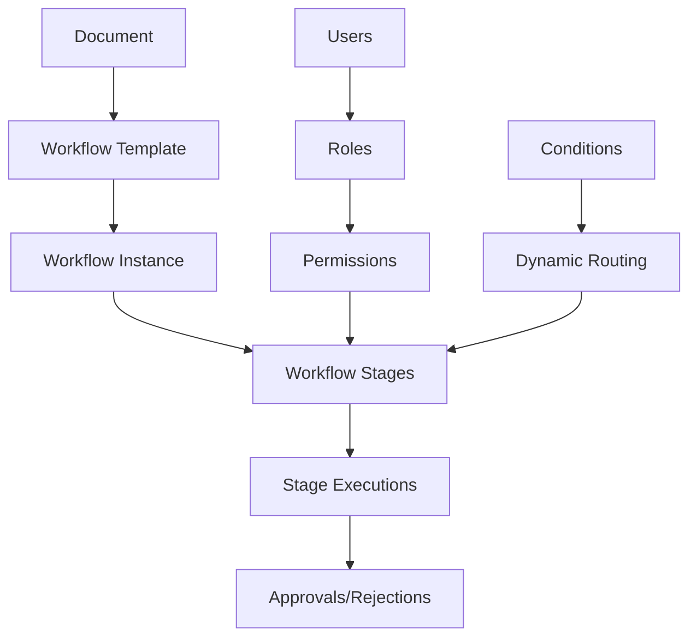

# Workflow Engine

Complete guide to the dynamic approval workflow system for document processing.

## Overview

The Liyali Gateway Backend includes a powerful workflow engine that provides:

- **Dynamic Workflow Configuration** - Create custom approval workflows
- **Multi-Stage Approvals** - Sequential and parallel approval stages
- **Role-Based Routing** - Route approvals based on user roles and permissions
- **Conditional Logic** - Dynamic routing based on document properties
- **Audit Trail** - Complete workflow execution history
- **Bulk Operations** - Process multiple documents simultaneously

## Workflow Architecture

### Workflow Components



### Workflow Models

#### Workflow Template
```go
type WorkflowTemplate struct {
    ID              string           `json:"id" gorm:"primaryKey"`
    OrganizationID  string           `json:"organizationId" gorm:"not null;index"`
    Name            string           `json:"name" gorm:"not null"`
    Description     string           `json:"description"`
    DocumentType    string           `json:"documentType" gorm:"not null;index"`
    Version         int              `json:"version" gorm:"default:1"`
    IsActive        bool             `json:"isActive" gorm:"default:true"`
    Stages          []WorkflowStage  `json:"stages" gorm:"foreignKey:WorkflowTemplateID"`
    Conditions      []WorkflowCondition `json:"conditions" gorm:"foreignKey:WorkflowTemplateID"`
    CreatedBy       string           `json:"createdBy" gorm:"not null"`
    CreatedAt       time.Time        `json:"createdAt"`
    UpdatedAt       time.Time        `json:"updatedAt"`
}
```

#### Workflow Stage
```go
type WorkflowStage struct {
    ID                 string                `json:"id" gorm:"primaryKey"`
    WorkflowTemplateID string                `json:"workflowTemplateId" gorm:"not null"`
    Name               string                `json:"name" gorm:"not null"`
    Description        string                `json:"description"`
    Order              int                   `json:"order" gorm:"not null"`
    StageType          string                `json:"stageType" gorm:"not null"` // approval, review, notification
    RequiredRole       string                `json:"requiredRole"`
    RequiredPermission string                `json:"requiredPermission"`
    IsParallel         bool                  `json:"isParallel" gorm:"default:false"`
    IsOptional         bool                  `json:"isOptional" gorm:"default:false"`
    TimeoutHours       *int                  `json:"timeoutHours,omitempty"`
    EscalationRole     *string               `json:"escalationRole,omitempty"`
    Conditions         []WorkflowStageCondition `json:"conditions" gorm:"foreignKey:WorkflowStageID"`
    CreatedAt          time.Time             `json:"createdAt"`
    UpdatedAt          time.Time             `json:"updatedAt"`
}
```

#### Workflow Instance
```go
type WorkflowInstance struct {
    ID                 string                  `json:"id" gorm:"primaryKey"`
    OrganizationID     string                  `json:"organizationId" gorm:"not null;index"`
    WorkflowTemplateID string                  `json:"workflowTemplateId" gorm:"not null"`
    DocumentID         string                  `json:"documentId" gorm:"not null;index"`
    DocumentType       string                  `json:"documentType" gorm:"not null"`
    Status             string                  `json:"status" gorm:"not null;index"` // pending, in_progress, completed, cancelled, failed
    CurrentStageID     *string                 `json:"currentStageId,omitempty"`
    StartedAt          time.Time               `json:"startedAt"`
    CompletedAt        *time.Time              `json:"completedAt,omitempty"`
    StartedBy          string                  `json:"startedBy" gorm:"not null"`
    Executions         []WorkflowExecution     `json:"executions" gorm:"foreignKey:WorkflowInstanceID"`
    CreatedAt          time.Time               `json:"createdAt"`
    UpdatedAt          time.Time               `json:"updatedAt"`
}
```

#### Workflow Execution
```go
type WorkflowExecution struct {
    ID                 string     `json:"id" gorm:"primaryKey"`
    WorkflowInstanceID string     `json:"workflowInstanceId" gorm:"not null"`
    WorkflowStageID    string     `json:"workflowStageId" gorm:"not null"`
    ExecutedBy         string     `json:"executedBy" gorm:"not null"`
    Decision           string     `json:"decision" gorm:"not null"` // approved, rejected, delegated, escalated
    Comment            string     `json:"comment"`
    ExecutedAt         time.Time  `json:"executedAt"`
    DueDate            *time.Time `json:"dueDate,omitempty"`
    CreatedAt          time.Time  `json:"createdAt"`
}
```

## Workflow Management API

### Create Workflow Template

```http
POST /api/v1/workflows/templates
Authorization: Bearer jwt-token
Content-Type: application/json

{
  "name": "Requisition Approval Workflow",
  "description": "Standard approval process for purchase requisitions",
  "documentType": "requisition",
  "stages": [
    {
      "name": "Department Manager Review",
      "description": "Initial review by department manager",
      "order": 1,
      "stageType": "approval",
      "requiredRole": "manager",
      "isParallel": false,
      "isOptional": false,
      "timeoutHours": 48,
      "escalationRole": "org_admin"
    },
    {
      "name": "Finance Review",
      "description": "Financial review for amounts over $1000",
      "order": 2,
      "stageType": "approval",
      "requiredRole": "finance_manager",
      "isParallel": false,
      "isOptional": false,
      "timeoutHours": 24,
      "conditions": [
        {
          "field": "totalAmount",
          "operator": "greater_than",
          "value": "1000"
        }
      ]
    },
    {
      "name": "Executive Approval",
      "description": "Executive approval for amounts over $5000",
      "order": 3,
      "stageType": "approval",
      "requiredRole": "executive",
      "isParallel": false,
      "isOptional": false,
      "timeoutHours": 72,
      "conditions": [
        {
          "field": "totalAmount",
          "operator": "greater_than",
          "value": "5000"
        }
      ]
    }
  ]
}
```

### Get Workflow Templates

```http
GET /api/v1/workflows/templates?documentType=requisition&active=true
Authorization: Bearer jwt-token
```

**Response:**
```json
{
  "success": true,
  "data": [
    {
      "id": "workflow-template-uuid",
      "organizationId": "org-uuid",
      "name": "Requisition Approval Workflow",
      "description": "Standard approval process for purchase requisitions",
      "documentType": "requisition",
      "version": 1,
      "isActive": true,
      "stages": [
        {
          "id": "stage-uuid-1",
          "name": "Department Manager Review",
          "order": 1,
          "stageType": "approval",
          "requiredRole": "manager",
          "timeoutHours": 48,
          "escalationRole": "org_admin"
        }
      ],
      "createdBy": "user-uuid",
      "createdAt": "2024-01-01T10:00:00Z",
      "updatedAt": "2024-01-01T10:00:00Z"
    }
  ],
  "pagination": {
    "page": 1,
    "total": 1,
    "totalPages": 1,
    "pageSize": 20,
    "hasNext": false,
    "hasPrev": false
  }
}
```

### Update Workflow Template

```http
PUT /api/v1/workflows/templates/{id}
Authorization: Bearer jwt-token
Content-Type: application/json

{
  "name": "Updated Requisition Approval Workflow",
  "description": "Updated approval process with new stages",
  "isActive": true
}
```

## Workflow Execution API

### Start Workflow

```http
POST /api/v1/workflows/instances
Authorization: Bearer jwt-token
Content-Type: application/json

{
  "workflowTemplateId": "workflow-template-uuid",
  "documentId": "document-uuid",
  "comment": "Starting approval process for laptop purchase"
}
```

**Response:**
```json
{
  "success": true,
  "data": {
    "id": "workflow-instance-uuid",
    "workflowTemplateId": "workflow-template-uuid",
    "documentId": "document-uuid",
    "documentType": "requisition",
    "status": "in_progress",
    "currentStageId": "stage-uuid-1",
    "startedAt": "2024-01-01T10:00:00Z",
    "startedBy": "user-uuid"
  }
}
```

### Get Workflow Instance

```http
GET /api/v1/workflows/instances/{id}
Authorization: Bearer jwt-token
```

**Response:**
```json
{
  "success": true,
  "data": {
    "id": "workflow-instance-uuid",
    "workflowTemplateId": "workflow-template-uuid",
    "documentId": "document-uuid",
    "documentType": "requisition",
    "status": "in_progress",
    "currentStageId": "stage-uuid-1",
    "startedAt": "2024-01-01T10:00:00Z",
    "startedBy": "user-uuid",
    "executions": [
      {
        "id": "execution-uuid-1",
        "workflowStageId": "stage-uuid-1",
        "executedBy": "manager-uuid",
        "decision": "approved",
        "comment": "Approved for department needs",
        "executedAt": "2024-01-01T14:00:00Z"
      }
    ]
  }
}
```

### Execute Workflow Stage

```http
POST /api/v1/workflows/instances/{id}/execute
Authorization: Bearer jwt-token
Content-Type: application/json

{
  "stageId": "stage-uuid-1",
  "decision": "approved",
  "comment": "Approved with minor modifications",
  "delegateTo": null
}
```

**Possible Decisions:**
- `approved` - Approve and move to next stage
- `rejected` - Reject and end workflow
- `delegated` - Delegate to another user
- `escalated` - Escalate to higher authority
- `returned` - Return to previous stage for modifications

### Get Pending Approvals

```http
GET /api/v1/workflows/pending?assignedTo=current&page=1&limit=20
Authorization: Bearer jwt-token
```

**Response:**
```json
{
  "success": true,
  "data": [
    {
      "workflowInstanceId": "workflow-instance-uuid",
      "documentId": "document-uuid",
      "documentType": "requisition",
      "documentTitle": "Laptop Purchase Request",
      "currentStage": {
        "id": "stage-uuid-1",
        "name": "Department Manager Review",
        "description": "Initial review by department manager",
        "requiredRole": "manager",
        "timeoutHours": 48
      },
      "submittedBy": "user-uuid",
      "submittedAt": "2024-01-01T10:00:00Z",
      "dueDate": "2024-01-03T10:00:00Z",
      "priority": "medium",
      "totalAmount": 2400.00
    }
  ],
  "pagination": {
    "page": 1,
    "total": 5,
    "totalPages": 1,
    "pageSize": 20,
    "hasNext": false,
    "hasPrev": false
  }
}
```

## Bulk Workflow Operations

### Bulk Approval

```http
POST /api/v1/workflows/bulk/approve
Authorization: Bearer jwt-token
Content-Type: application/json

{
  "workflowInstanceIds": [
    "workflow-instance-uuid-1",
    "workflow-instance-uuid-2",
    "workflow-instance-uuid-3"
  ],
  "comment": "Bulk approval for Q1 requisitions",
  "decision": "approved"
}
```

### Bulk Rejection

```http
POST /api/v1/workflows/bulk/reject
Authorization: Bearer jwt-token
Content-Type: application/json

{
  "workflowInstanceIds": [
    "workflow-instance-uuid-1",
    "workflow-instance-uuid-2"
  ],
  "comment": "Insufficient budget allocation",
  "decision": "rejected"
}
```

### Bulk Delegation

```http
POST /api/v1/workflows/bulk/delegate
Authorization: Bearer jwt-token
Content-Type: application/json

{
  "workflowInstanceIds": [
    "workflow-instance-uuid-1",
    "workflow-instance-uuid-2"
  ],
  "delegateTo": "manager-uuid",
  "comment": "Delegating while on vacation"
}
```

## Workflow Conditions

### Conditional Routing

Workflows support dynamic routing based on document properties:

#### Amount-Based Routing
```json
{
  "field": "totalAmount",
  "operator": "greater_than",
  "value": "5000",
  "action": "require_stage",
  "targetStageId": "executive-approval-stage"
}
```

#### Department-Based Routing
```json
{
  "field": "department",
  "operator": "equals",
  "value": "IT",
  "action": "skip_stage",
  "targetStageId": "finance-review-stage"
}
```

#### Priority-Based Routing
```json
{
  "field": "priority",
  "operator": "equals",
  "value": "urgent",
  "action": "reduce_timeout",
  "timeoutHours": 4
}
```

### Supported Operators

- `equals` - Exact match
- `not_equals` - Not equal
- `greater_than` - Numeric greater than
- `less_than` - Numeric less than
- `greater_than_or_equal` - Numeric greater than or equal
- `less_than_or_equal` - Numeric less than or equal
- `contains` - String contains
- `starts_with` - String starts with
- `ends_with` - String ends with
- `in` - Value in list
- `not_in` - Value not in list

### Supported Actions

- `require_stage` - Add required stage
- `skip_stage` - Skip optional stage
- `change_assignee` - Change stage assignee
- `reduce_timeout` - Reduce stage timeout
- `increase_timeout` - Increase stage timeout
- `add_notification` - Add notification
- `escalate_immediately` - Immediate escalation

## Workflow Analytics

### Workflow Performance

```http
GET /api/v1/workflows/analytics/performance?templateId=workflow-template-uuid&startDate=2024-01-01&endDate=2024-01-31
Authorization: Bearer jwt-token
```

**Response:**
```json
{
  "success": true,
  "data": {
    "totalWorkflows": 45,
    "completedWorkflows": 40,
    "pendingWorkflows": 3,
    "cancelledWorkflows": 2,
    "averageCompletionTime": "2.5 days",
    "stagePerformance": [
      {
        "stageName": "Department Manager Review",
        "averageTime": "1.2 days",
        "approvalRate": 0.85,
        "escalationRate": 0.05
      },
      {
        "stageName": "Finance Review",
        "averageTime": "0.8 days",
        "approvalRate": 0.92,
        "escalationRate": 0.02
      }
    ],
    "bottlenecks": [
      {
        "stageName": "Executive Approval",
        "averageTime": "3.2 days",
        "reason": "High volume, limited approvers"
      }
    ]
  }
}
```

### Approval Statistics

```http
GET /api/v1/workflows/analytics/approvals?userId=user-uuid&period=month
Authorization: Bearer jwt-token
```

**Response:**
```json
{
  "success": true,
  "data": {
    "totalApprovals": 25,
    "approvedCount": 20,
    "rejectedCount": 3,
    "delegatedCount": 2,
    "averageApprovalTime": "4.2 hours",
    "approvalsByType": {
      "requisition": 15,
      "budget": 5,
      "purchase_order": 5
    },
    "approvalTrend": [
      {
        "date": "2024-01-01",
        "approved": 3,
        "rejected": 1
      }
    ]
  }
}
```

## Workflow Notifications

### Email Notifications

The system sends automatic email notifications for:

- **New Approval Required** - When a document reaches a user's approval stage
- **Approval Timeout** - When an approval is overdue
- **Workflow Completed** - When a workflow is completed
- **Workflow Rejected** - When a workflow is rejected
- **Escalation** - When an approval is escalated

### Notification Configuration

```http
PUT /api/v1/workflows/notifications/settings
Authorization: Bearer jwt-token
Content-Type: application/json

{
  "emailNotifications": true,
  "smsNotifications": false,
  "notificationTypes": [
    "approval_required",
    "approval_timeout",
    "workflow_completed"
  ],
  "reminderIntervals": [24, 48, 72]
}
```

## Advanced Workflow Features

### Parallel Approvals

Configure stages to run in parallel:

```json
{
  "name": "Parallel Finance and Legal Review",
  "stages": [
    {
      "name": "Finance Review",
      "order": 2,
      "isParallel": true,
      "parallelGroup": "review_group_1"
    },
    {
      "name": "Legal Review",
      "order": 2,
      "isParallel": true,
      "parallelGroup": "review_group_1"
    }
  ]
}
```

### Dynamic Assignee Selection

Assign approvers dynamically based on document properties:

```json
{
  "assigneeSelection": {
    "type": "dynamic",
    "rules": [
      {
        "condition": {
          "field": "department",
          "operator": "equals",
          "value": "IT"
        },
        "assignee": "it_manager"
      },
      {
        "condition": {
          "field": "totalAmount",
          "operator": "greater_than",
          "value": "10000"
        },
        "assignee": "cfo"
      }
    ],
    "fallback": "org_admin"
  }
}
```

### Workflow Templates

Create reusable workflow templates:

```http
POST /api/v1/workflows/templates/clone
Authorization: Bearer jwt-token
Content-Type: application/json

{
  "sourceTemplateId": "workflow-template-uuid",
  "name": "Cloned Requisition Workflow",
  "documentType": "purchase_order",
  "modifications": [
    {
      "stageId": "stage-uuid-1",
      "changes": {
        "timeoutHours": 24,
        "requiredRole": "procurement_manager"
      }
    }
  ]
}
```

## Workflow Security

### Permission-Based Access

All workflow operations respect user permissions:

```go
// Example permission checks
"workflows.create"           // Create workflow templates
"workflows.read"             // View workflows
"workflows.update"           // Update workflow templates
"workflows.delete"           // Delete workflow templates
"workflows.execute"          // Execute workflow stages
"workflows.approve"          // Approve workflow stages
"workflows.reject"           // Reject workflow stages
"workflows.delegate"         // Delegate approvals
"workflows.escalate"         // Escalate approvals
"workflows.admin"            // Full workflow administration
```

### Audit Trail

All workflow actions are logged:

```go
type WorkflowAuditLog struct {
    ID                 string    `json:"id"`
    WorkflowInstanceID string    `json:"workflowInstanceId"`
    Action             string    `json:"action"`
    ExecutedBy         string    `json:"executedBy"`
    PreviousState      string    `json:"previousState"`
    NewState           string    `json:"newState"`
    Comment            string    `json:"comment"`
    IPAddress          string    `json:"ipAddress"`
    UserAgent          string    `json:"userAgent"`
    Timestamp          time.Time `json:"timestamp"`
}
```

## Testing Workflows

### Unit Tests

```go
func TestWorkflowExecution(t *testing.T) {
    // Create test workflow template
    template := &WorkflowTemplate{
        Name:         "Test Workflow",
        DocumentType: "requisition",
        Stages: []WorkflowStage{
            {
                Name:         "Manager Approval",
                Order:        1,
                RequiredRole: "manager",
            },
        },
    }
    
    templateID, err := workflowService.CreateTemplate(testUserID, template)
    assert.NoError(t, err)
    
    // Start workflow instance
    instance, err := workflowService.StartWorkflow(testUserID, &StartWorkflowRequest{
        WorkflowTemplateID: templateID,
        DocumentID:         testDocumentID,
    })
    assert.NoError(t, err)
    assert.Equal(t, "in_progress", instance.Status)
    
    // Execute approval
    err = workflowService.ExecuteStage(managerUserID, instance.ID, &ExecuteStageRequest{
        StageID:  instance.CurrentStageID,
        Decision: "approved",
        Comment:  "Test approval",
    })
    assert.NoError(t, err)
}
```

### Integration Tests

```go
func TestEndToEndWorkflow(t *testing.T) {
    // Create requisition
    req := createTestRequisition(t)
    
    // Start workflow
    resp := httptest.NewRecorder()
    reqBody := `{
        "workflowTemplateId": "` + testWorkflowTemplateID + `",
        "documentId": "` + req.ID + `",
        "comment": "Starting approval process"
    }`
    
    httpReq := httptest.NewRequest("POST", "/api/v1/workflows/instances", 
        strings.NewReader(reqBody))
    httpReq.Header.Set("Authorization", "Bearer "+testJWT)
    
    router.ServeHTTP(resp, httpReq)
    assert.Equal(t, 201, resp.Code)
    
    // Parse response
    var workflowResp struct {
        Data WorkflowInstance `json:"data"`
    }
    json.Unmarshal(resp.Body.Bytes(), &workflowResp)
    
    // Execute approval
    resp = httptest.NewRecorder()
    approvalBody := `{
        "stageId": "` + workflowResp.Data.CurrentStageID + `",
        "decision": "approved",
        "comment": "Integration test approval"
    }`
    
    httpReq = httptest.NewRequest("POST", 
        "/api/v1/workflows/instances/"+workflowResp.Data.ID+"/execute",
        strings.NewReader(approvalBody))
    httpReq.Header.Set("Authorization", "Bearer "+managerJWT)
    
    router.ServeHTTP(resp, httpReq)
    assert.Equal(t, 200, resp.Code)
}
```

## Best Practices

### Workflow Design

1. **Keep stages simple** - Each stage should have a single responsibility
2. **Use clear naming** - Stage names should be descriptive and user-friendly
3. **Set appropriate timeouts** - Balance urgency with realistic processing time
4. **Plan for exceptions** - Include escalation and delegation paths
5. **Test thoroughly** - Test all workflow paths and conditions

### Performance Optimization

1. **Index workflow queries** - Optimize database queries for workflow lookups
2. **Cache workflow templates** - Cache frequently used templates
3. **Batch notifications** - Group notifications to reduce email volume
4. **Monitor performance** - Track workflow completion times and bottlenecks
5. **Clean up completed workflows** - Archive old workflow instances

### Security Considerations

1. **Validate permissions** - Always check user permissions before workflow actions
2. **Audit all actions** - Log all workflow executions for compliance
3. **Secure sensitive data** - Protect confidential information in workflow comments
4. **Implement timeouts** - Prevent workflows from running indefinitely
5. **Regular security reviews** - Review workflow permissions and access patterns

## Troubleshooting

### Common Issues

**Workflow Not Starting**
- Check workflow template is active
- Verify user has permission to start workflows
- Confirm document type matches template

**Stage Not Executing**
- Verify user has required role/permission
- Check if stage conditions are met
- Confirm workflow instance is in correct state

**Notifications Not Sent**
- Check email configuration
- Verify notification settings
- Review notification logs

**Performance Issues**
- Check database indexes
- Monitor workflow query performance
- Review workflow complexity

For detailed troubleshooting, see [Troubleshooting Guide](./16-troubleshooting.md).

## Next Steps

- **Search & Analytics**: Learn about [Advanced Search](./10-search.md)
- **Development**: Set up [Development Environment](./11-development.md)
- **API Reference**: Explore [Complete API Documentation](./13-api-reference.md)
- **Testing**: Implement [Workflow Testing](./12-testing.md)