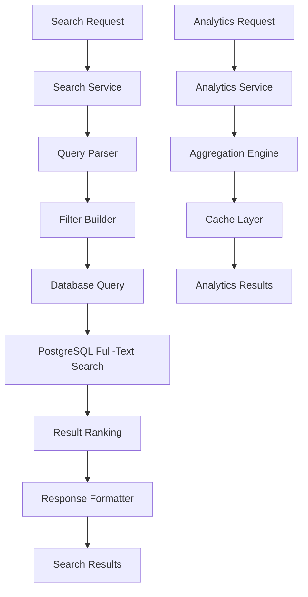

# Search & Analytics

Complete guide to the advanced search capabilities and analytics features.

## Overview

The Liyali Gateway Backend provides powerful search and analytics capabilities:

- **Full-Text Search** - Advanced text search across all document types
- **Faceted Search** - Filter by multiple criteria simultaneously
- **Cross-Document Search** - Search across different document types
- **Real-Time Analytics** - Live dashboard metrics and KPIs
- **Custom Reports** - Generate detailed reports and exports
- **Search Suggestions** - Auto-complete and search recommendations

## Search Architecture

### Search Components



### Search Indexes

The system uses PostgreSQL's built-in full-text search with optimized indexes:

```sql
-- Full-text search index
CREATE INDEX idx_documents_fts ON documents 
USING gin(to_tsvector('english', title || ' ' || description || ' ' || document_number));

-- Composite indexes for filtered searches
CREATE INDEX idx_documents_search_filters ON documents(organization_id, document_type, status, created_at);
CREATE INDEX idx_documents_amount_range ON documents(organization_id, total_amount) WHERE total_amount IS NOT NULL;
CREATE INDEX idx_documents_date_range ON documents(organization_id, created_at);
```

## Search API

### Basic Search

#### Simple Text Search
```http
GET /api/v1/search?q=laptop
Authorization: Bearer jwt-token
```

**Response:**
```json
{
  "success": true,
  "data": {
    "results": [
      {
        "id": "doc-uuid",
        "documentType": "requisition",
        "documentNumber": "REQ-2024-001",
        "title": "Laptop Purchase Request",
        "description": "MacBook Pro for development team",
        "status": "approved",
        "totalAmount": 2400.00,
        "createdBy": "user-uuid",
        "createdAt": "2024-01-01T10:00:00Z",
        "relevanceScore": 0.95,
        "highlights": {
          "title": ["<mark>Laptop</mark> Purchase Request"],
          "description": ["MacBook Pro for development team"]
        }
      }
    ],
    "facets": {
      "documentType": {
        "requisition": 15,
        "budget": 5,
        "purchase_order": 8
      },
      "status": {
        "approved": 12,
        "pending": 8,
        "rejected": 3
      }
    },
    "suggestions": [
      "laptop computer",
      "laptop accessories",
      "laptop repair"
    ]
  },
  "pagination": {
    "page": 1,
    "total": 28,
    "totalPages": 2,
    "pageSize": 20,
    "hasNext": true,
    "hasPrev": false
  }
}
```

### Advanced Search

#### Multi-Criteria Search
```http
GET /api/v1/search?q=laptop&type=requisition&status=approved&minAmount=1000&maxAmount=5000&department=IT&startDate=2024-01-01&endDate=2024-01-31&sort=relevance&order=desc&page=1&limit=20
Authorization: Bearer jwt-token
```

**Query Parameters:**
- `q` - Search query (full-text search)
- `type` - Document type filter
- `status` - Status filter
- `priority` - Priority filter
- `department` - Department filter
- `createdBy` - Creator filter
- `assignedTo` - Assignee filter
- `minAmount` - Minimum amount filter
- `maxAmount` - Maximum amount filter
- `startDate` - Created after date (ISO 8601)
- `endDate` - Created before date (ISO 8601)
- `tags` - Tag filter (comma-separated)
- `sort` - Sort field (relevance, date, amount, title)
- `order` - Sort order (asc, desc)
- `page` - Page number
- `limit` - Results per page (max 100)
- `includeHighlights` - Include search highlights (true/false)
- `includeFacets` - Include facet counts (true/false)
- `includeSuggestions` - Include search suggestions (true/false)

### Faceted Search

#### Get Search Facets
```http
GET /api/v1/search/facets?q=laptop
Authorization: Bearer jwt-token
```

**Response:**
```json
{
  "success": true,
  "data": {
    "documentType": {
      "requisition": 15,
      "purchase_order": 8,
      "budget": 2
    },
    "status": {
      "approved": 12,
      "pending": 8,
      "under_review": 3,
      "rejected": 2
    },
    "priority": {
      "high": 5,
      "medium": 15,
      "low": 5
    },
    "department": {
      "IT": 18,
      "Finance": 4,
      "HR": 3
    },
    "amountRanges": {
      "0-1000": 8,
      "1000-5000": 12,
      "5000-10000": 4,
      "10000+": 1
    },
    "dateRanges": {
      "last_week": 5,
      "last_month": 15,
      "last_quarter": 20,
      "older": 5
    }
  }
}
```

### Search Suggestions

#### Get Auto-Complete Suggestions
```http
GET /api/v1/search/suggestions?q=lap&limit=10
Authorization: Bearer jwt-token
```

**Response:**
```json
{
  "success": true,
  "data": {
    "suggestions": [
      {
        "text": "laptop",
        "count": 25,
        "type": "term"
      },
      {
        "text": "laptop computer",
        "count": 15,
        "type": "phrase"
      },
      {
        "text": "laptop accessories",
        "count": 8,
        "type": "phrase"
      }
    ],
    "recent": [
      "laptop purchase",
      "laptop repair",
      "laptop upgrade"
    ],
    "popular": [
      "office supplies",
      "software licenses",
      "equipment maintenance"
    ]
  }
}
```

### Saved Searches

#### Save Search Query
```http
POST /api/v1/search/saved
Authorization: Bearer jwt-token
Content-Type: application/json

{
  "name": "High Priority IT Requisitions",
  "description": "All high priority requisitions from IT department",
  "query": {
    "q": "",
    "type": "requisition",
    "department": "IT",
    "priority": "high",
    "status": "pending"
  },
  "isPublic": false,
  "notifications": {
    "enabled": true,
    "frequency": "daily"
  }
}
```

#### Get Saved Searches
```http
GET /api/v1/search/saved
Authorization: Bearer jwt-token
```

#### Execute Saved Search
```http
GET /api/v1/search/saved/{id}/execute?page=1&limit=20
Authorization: Bearer jwt-token
```

## Analytics API

### Dashboard Analytics

#### Get Dashboard Overview
```http
GET /api/v1/analytics/dashboard
Authorization: Bearer jwt-token
```

**Response:**
```json
{
  "success": true,
  "data": {
    "summary": {
      "totalDocuments": 1250,
      "totalValue": 2500000.00,
      "pendingApprovals": 45,
      "completedThisMonth": 125,
      "averageProcessingTime": "2.5 days"
    },
    "documentsByType": {
      "requisition": 450,
      "budget": 120,
      "purchase_order": 380,
      "payment_voucher": 200,
      "grn": 100
    },
    "documentsByStatus": {
      "draft": 50,
      "submitted": 75,
      "under_review": 125,
      "approved": 800,
      "rejected": 100,
      "completed": 100
    },
    "monthlyTrend": [
      {
        "month": "2024-01",
        "created": 95,
        "completed": 88,
        "value": 185000.00
      },
      {
        "month": "2024-02",
        "created": 110,
        "completed": 105,
        "value": 220000.00
      }
    ],
    "topDepartments": [
      {
        "department": "IT",
        "documentCount": 180,
        "totalValue": 450000.00
      },
      {
        "department": "Finance",
        "documentCount": 120,
        "totalValue": 280000.00
      }
    ],
    "recentActivity": [
      {
        "type": "document_created",
        "documentType": "requisition",
        "documentTitle": "New Laptop Request",
        "user": "John Doe",
        "timestamp": "2024-01-15T10:30:00Z"
      }
    ]
  }
}
```

### Document Analytics

#### Get Document Statistics
```http
GET /api/v1/analytics/documents?period=month&groupBy=type&startDate=2024-01-01&endDate=2024-01-31
Authorization: Bearer jwt-token
```

**Query Parameters:**
- `period` - Time period (day, week, month, quarter, year)
- `groupBy` - Group by field (type, status, department, user)
- `startDate` - Start date for analysis
- `endDate` - End date for analysis
- `documentType` - Filter by document type
- `department` - Filter by department

**Response:**
```json
{
  "success": true,
  "data": {
    "period": "month",
    "groupBy": "type",
    "dateRange": {
      "start": "2024-01-01T00:00:00Z",
      "end": "2024-01-31T23:59:59Z"
    },
    "statistics": [
      {
        "group": "requisition",
        "count": 45,
        "totalValue": 125000.00,
        "averageValue": 2777.78,
        "averageProcessingTime": "2.1 days",
        "approvalRate": 0.89
      },
      {
        "group": "purchase_order",
        "count": 32,
        "totalValue": 98000.00,
        "averageValue": 3062.50,
        "averageProcessingTime": "1.8 days",
        "approvalRate": 0.94
      }
    ],
    "trends": [
      {
        "date": "2024-01-01",
        "requisition": 2,
        "purchase_order": 1,
        "budget": 0
      }
    ]
  }
}
```

### Workflow Analytics

#### Get Workflow Performance
```http
GET /api/v1/analytics/workflows?templateId=workflow-uuid&period=month
Authorization: Bearer jwt-token
```

**Response:**
```json
{
  "success": true,
  "data": {
    "workflowTemplate": {
      "id": "workflow-uuid",
      "name": "Requisition Approval Workflow"
    },
    "performance": {
      "totalInstances": 85,
      "completedInstances": 78,
      "pendingInstances": 5,
      "cancelledInstances": 2,
      "averageCompletionTime": "2.3 days",
      "completionRate": 0.92
    },
    "stageAnalytics": [
      {
        "stageName": "Manager Review",
        "averageTime": "1.2 days",
        "approvalRate": 0.88,
        "escalationRate": 0.05,
        "bottleneckScore": 0.3
      },
      {
        "stageName": "Finance Review",
        "averageTime": "0.8 days",
        "approvalRate": 0.95,
        "escalationRate": 0.02,
        "bottleneckScore": 0.1
      }
    ],
    "bottlenecks": [
      {
        "stage": "Executive Approval",
        "averageDelay": "1.5 days",
        "reason": "Limited approver availability"
      }
    ],
    "recommendations": [
      {
        "type": "add_approver",
        "stage": "Executive Approval",
        "description": "Consider adding additional executive approvers"
      }
    ]
  }
}
```

### User Analytics

#### Get User Activity
```http
GET /api/v1/analytics/users/{userId}?period=month
Authorization: Bearer jwt-token
```

**Response:**
```json
{
  "success": true,
  "data": {
    "user": {
      "id": "user-uuid",
      "name": "John Doe",
      "department": "IT"
    },
    "activity": {
      "documentsCreated": 15,
      "documentsApproved": 25,
      "documentsRejected": 3,
      "averageApprovalTime": "4.2 hours",
      "totalValueProcessed": 85000.00
    },
    "productivity": {
      "documentsPerDay": 1.2,
      "approvalVelocity": "high",
      "qualityScore": 0.92
    },
    "trends": [
      {
        "date": "2024-01-01",
        "created": 1,
        "approved": 2,
        "rejected": 0
      }
    ]
  }
}
```

## Custom Reports

### Generate Report

#### Create Custom Report
```http
POST /api/v1/analytics/reports
Authorization: Bearer jwt-token
Content-Type: application/json

{
  "name": "Monthly Procurement Report",
  "description": "Comprehensive monthly procurement analysis",
  "type": "custom",
  "parameters": {
    "dateRange": {
      "start": "2024-01-01",
      "end": "2024-01-31"
    },
    "documentTypes": ["requisition", "purchase_order"],
    "departments": ["IT", "Finance", "HR"],
    "includeCharts": true,
    "includeDetails": true
  },
  "schedule": {
    "enabled": true,
    "frequency": "monthly",
    "recipients": ["manager@company.com", "finance@company.com"]
  }
}
```

#### Get Report
```http
GET /api/v1/analytics/reports/{reportId}
Authorization: Bearer jwt-token
```

#### Export Report
```http
GET /api/v1/analytics/reports/{reportId}/export?format=pdf
Authorization: Bearer jwt-token
```

**Supported Formats:**
- `pdf` - PDF document
- `excel` - Excel spreadsheet
- `csv` - CSV file
- `json` - JSON data

### Scheduled Reports

#### Get Scheduled Reports
```http
GET /api/v1/analytics/reports/scheduled
Authorization: Bearer jwt-token
```

#### Update Report Schedule
```http
PUT /api/v1/analytics/reports/{reportId}/schedule
Authorization: Bearer jwt-token
Content-Type: application/json

{
  "enabled": true,
  "frequency": "weekly",
  "dayOfWeek": "monday",
  "time": "09:00",
  "recipients": ["team@company.com"],
  "format": "pdf"
}
```

## Search Performance Optimization

### Query Optimization

The system implements several optimization strategies:

#### 1. Index Usage
```sql
-- Optimized search query with proper index usage
EXPLAIN (ANALYZE, BUFFERS) 
SELECT d.*, ts_rank(search_vector, query) as rank
FROM documents d, plainto_tsquery('english', $1) query
WHERE d.organization_id = $2
  AND d.search_vector @@ query
  AND ($3::text IS NULL OR d.document_type = $3)
  AND ($4::text IS NULL OR d.status = $4)
ORDER BY rank DESC, d.created_at DESC
LIMIT $5 OFFSET $6;
```

#### 2. Result Caching
```go
// Cache frequently accessed search results
func (s *SearchService) Search(req *SearchRequest) (*SearchResponse, error) {
    cacheKey := s.generateCacheKey(req)
    
    // Check cache first
    if cached, found := s.cache.Get(cacheKey); found {
        return cached.(*SearchResponse), nil
    }
    
    // Execute search
    results, err := s.executeSearch(req)
    if err != nil {
        return nil, err
    }
    
    // Cache results for 5 minutes
    s.cache.Set(cacheKey, results, 5*time.Minute)
    
    return results, nil
}
```

#### 3. Pagination Optimization
```go
// Use cursor-based pagination for large result sets
func (s *SearchService) SearchWithCursor(req *SearchRequest) (*SearchResponse, error) {
    query := s.buildQuery(req)
    
    if req.Cursor != "" {
        // Decode cursor and add to query
        cursor, _ := s.decodeCursor(req.Cursor)
        query = query.Where("created_at < ?", cursor.CreatedAt)
    }
    
    results := query.Limit(req.Limit + 1).Find(&documents)
    
    // Generate next cursor if more results exist
    var nextCursor string
    if len(results) > req.Limit {
        nextCursor = s.encodeCursor(results[req.Limit-1])
        results = results[:req.Limit]
    }
    
    return &SearchResponse{
        Data:       results,
        NextCursor: nextCursor,
        HasMore:    nextCursor != "",
    }, nil
}
```

### Analytics Performance

#### 1. Pre-computed Aggregations
```sql
-- Materialized view for dashboard analytics
CREATE MATERIALIZED VIEW dashboard_stats AS
SELECT 
    organization_id,
    document_type,
    status,
    DATE_TRUNC('day', created_at) as date,
    COUNT(*) as document_count,
    SUM(total_amount) as total_value,
    AVG(total_amount) as average_value
FROM documents
GROUP BY organization_id, document_type, status, DATE_TRUNC('day', created_at);

-- Refresh materialized view periodically
REFRESH MATERIALIZED VIEW CONCURRENTLY dashboard_stats;
```

#### 2. Background Analytics Processing
```go
// Background job for analytics computation
func (s *AnalyticsService) ComputeDashboardStats() {
    ticker := time.NewTicker(1 * time.Hour)
    defer ticker.Stop()
    
    for {
        select {
        case <-ticker.C:
            s.refreshMaterializedViews()
            s.updateAnalyticsCache()
        case <-s.stopChan:
            return
        }
    }
}
```

## Search Security

### Permission-Based Filtering

All search results are filtered based on user permissions:

```go
func (s *SearchService) Search(userID string, req *SearchRequest) (*SearchResponse, error) {
    user, err := s.userService.GetByID(userID)
    if err != nil {
        return nil, err
    }
    
    // Build base query with organization filter
    query := s.db.Where("organization_id = ?", user.OrganizationID)
    
    // Apply permission-based filters
    if !s.authService.HasPermission(userID, "documents.read_all") {
        // User can only see their own documents or public ones
        query = query.Where("created_by = ? OR visibility = 'public'", userID)
    }
    
    // Apply additional security filters
    if !s.authService.HasPermission(userID, "documents.read_financial") {
        // Hide financial information
        query = query.Select("id, title, description, status, created_at")
    }
    
    return s.executeQuery(query, req)
}
```

### Data Masking

Sensitive data is masked based on user permissions:

```go
func (s *SearchService) maskSensitiveData(doc *Document, userID string) {
    if !s.authService.HasPermission(userID, "documents.read_financial") {
        doc.TotalAmount = nil
        doc.TypeSpecificData = s.maskFinancialFields(doc.TypeSpecificData)
    }
    
    if !s.authService.HasPermission(userID, "documents.read_personal") {
        doc.CreatedBy = "***"
        doc.TypeSpecificData = s.maskPersonalFields(doc.TypeSpecificData)
    }
}
```

## Testing Search & Analytics

### Unit Tests

```go
func TestFullTextSearch(t *testing.T) {
    // Create test documents
    docs := []*Document{
        {
            Title:       "Laptop Purchase Request",
            Description: "MacBook Pro for development",
            DocumentType: "requisition",
        },
        {
            Title:       "Office Supplies",
            Description: "Pens, papers, and laptop accessories",
            DocumentType: "requisition",
        },
    }
    
    for _, doc := range docs {
        repo.Create(doc)
    }
    
    // Test search
    results, err := searchService.Search(testUserID, &SearchRequest{
        Query: "laptop",
        Limit: 10,
    })
    
    assert.NoError(t, err)
    assert.Len(t, results.Data, 2)
    
    // Verify relevance ranking
    assert.Contains(t, results.Data[0].Title, "Laptop")
    assert.Greater(t, results.Data[0].RelevanceScore, results.Data[1].RelevanceScore)
}
```

### Performance Tests

```go
func BenchmarkSearch(b *testing.B) {
    // Create large dataset
    for i := 0; i < 10000; i++ {
        repo.Create(&Document{
            Title:       fmt.Sprintf("Document %d", i),
            Description: "Test document for performance testing",
        })
    }
    
    b.ResetTimer()
    
    for i := 0; i < b.N; i++ {
        searchService.Search(testUserID, &SearchRequest{
            Query: "document",
            Limit: 20,
        })
    }
}
```

## Best Practices

### Search Best Practices

1. **Use specific queries** - More specific searches return better results
2. **Leverage filters** - Use filters to narrow down results
3. **Implement pagination** - Always paginate large result sets
4. **Cache frequent searches** - Cache popular search queries
5. **Monitor performance** - Track search query performance

### Analytics Best Practices

1. **Pre-compute aggregations** - Use materialized views for complex analytics
2. **Implement caching** - Cache analytics results for better performance
3. **Use background processing** - Compute analytics asynchronously
4. **Optimize queries** - Use proper indexes and query optimization
5. **Monitor resource usage** - Track analytics query performance

### Security Best Practices

1. **Filter by permissions** - Always apply permission-based filtering
2. **Mask sensitive data** - Hide sensitive information based on user roles
3. **Audit search queries** - Log search activities for security monitoring
4. **Validate inputs** - Sanitize and validate all search inputs
5. **Rate limit searches** - Prevent search abuse with rate limiting

## Troubleshooting

### Common Search Issues

**Slow Search Performance**
- Check database indexes
- Review query complexity
- Monitor cache hit rates
- Optimize search filters

**Incorrect Search Results**
- Verify full-text search configuration
- Check search query parsing
- Review relevance scoring
- Test with simpler queries

**Missing Results**
- Check permission filters
- Verify organization context
- Review data synchronization
- Test with different users

### Common Analytics Issues

**Slow Dashboard Loading**
- Check materialized view refresh
- Review analytics query performance
- Monitor cache effectiveness
- Optimize aggregation queries

**Incorrect Analytics Data**
- Verify data synchronization
- Check calculation logic
- Review date range filters
- Test with known data sets

For detailed troubleshooting, see [Troubleshooting Guide](./16-troubleshooting.md).

## Next Steps

- **Development**: Set up [Development Environment](./11-development.md)
- **Testing**: Implement [Search Testing](./12-testing.md)
- **API Reference**: Explore [Complete API Documentation](./13-api-reference.md)
- **Monitoring**: Set up [Performance Monitoring](./15-monitoring.md)