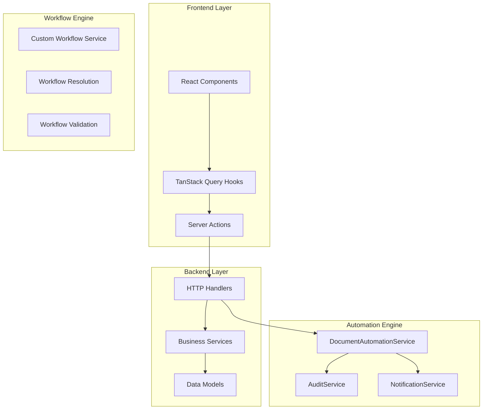

# Liyali Gateway Workflow System Architecture

## Overview

The Liyali Gateway implements a sophisticated hybrid workflow system that combines **Document Automation** with **Custom Workflow Management**. This architecture provides both automated document progression and configurable approval workflows for enterprise procurement processes.

## System Architecture

### Core Components



## Document Automation System

### Workflow Chain

The document automation system implements a linear procurement workflow:

```
Requisition (Approved) → Purchase Order (Auto-Created)
     ↓
Purchase Order (Approved) → GRN (Auto-Created)  
     ↓
GRN (Approved) → Payment Voucher (Auto-Created)
```

### Implementation Details

#### 1. Service Architecture

```go
type DocumentAutomationService struct {
    db              *gorm.DB
    auditService    *AuditService
    notificationSvc *NotificationService
}

type AutomationConfig struct {
    AutoCreatePOFromRequisition bool
    AutoCreateGRNFromPO         bool
    AutoCreatePVFromGRN         bool
    RequireApprovalForAuto      bool
}
```

**Key Features:**
- **Dependency Injection**: Modular service design
- **Configuration-Driven**: Runtime toggleable automation
- **Error Isolation**: Automation failures don't break approvals
- **Audit Trail**: Complete logging of all automated actions

#### 2. Automation Triggers

Automation is triggered at specific approval points in the HTTP handlers:

```go
// In ApproveRequisition handler
if requisition.Status == "approved" {
    automationService := services.NewDocumentAutomationService(...)
    result, err := automationService.CreatePurchaseOrderFromRequisition(...)
    
    if err == nil && result.Success {
        response.Data = fiber.Map{
            "requisition":      originalRequisition,
            "autoCreatedPO":    autoCreatedPO,
            "automationUsed":   true,
        }
    }
}
```

**Design Principles:**
- **Non-Blocking**: Primary operations succeed regardless of automation
- **Immediate Response**: Auto-created documents returned in API response
- **Graceful Degradation**: System functions normally without automation

#### 3. Document Linking Strategy

Documents are linked through a hierarchical reference system:

```go
// Requisition → Purchase Order
purchaseOrder.LinkedRequisition = requisition.ID
purchaseOrder.VendorID = *requisition.PreferredVendorID

// Purchase Order → GRN
grn.PONumber = purchaseOrder.PONumber

// GRN → Payment Voucher
paymentVoucher.LinkedPO = purchaseOrder.PONumber
paymentVoucher.VendorID = purchaseOrder.VendorID
```

#### 4. Item Transformation

Items are transformed between document types with appropriate field mappings:

```go
// Requisition Items → PO Items
poItems[i] = types.POItem{
    Description: reqItem.Description,
    Quantity:    reqItem.Quantity,
    UnitPrice:   reqItem.UnitPrice,
    Amount:      reqItem.Amount,
}

// PO Items → GRN Items
grnItems[i] = types.GRNItem{
    Description:      poItem.Description,
    QuantityOrdered:  poItem.Quantity,
    QuantityReceived: 0,  // Filled by warehouse
    Variance:         0,  // Calculated later
    Condition:        "pending",
}
```

## Frontend Integration

### React Query Integration

The frontend uses TanStack Query for state management with smart cache invalidation:

```typescript
// In useApprovePurchaseOrder hook
onSuccess: (response) => {
    const automationUsed = response.data?.automationUsed;
    const autoCreatedGRN = response.data?.autoCreatedGRN;

    if (automationUsed && autoCreatedGRN) {
        toast.success("Purchase order approved and GRN created automatically");
        
        // Smart cache invalidation
        queryClient.invalidateQueries({
            queryKey: [QUERY_KEYS.GRN.ALL],
        });
    }
}
```

### Cache Management Strategy

**Invalidation Rules:**
- **Primary Document**: Always invalidate approved document cache
- **Auto-Created Documents**: Conditionally invalidate related caches
- **Dashboard Metrics**: Always invalidate for updated counts
- **List Views**: Invalidate to show new documents

**Cache Keys Affected:**
```typescript
[QUERY_KEYS.PURCHASE_ORDERS.BY_ID, poId]  // Updated PO
[QUERY_KEYS.PURCHASE_ORDERS.ALL]          // PO list
[QUERY_KEYS.GRN.ALL]                      // GRN list (new)
[QUERY_KEYS.DASHBOARD.METRICS]            // Counts
```

## Custom Workflow Engine

### Workflow Definition

The system supports configurable workflows for different entity types:

```typescript
interface CustomWorkflow {
    id: string;
    name: string;
    version: number;
    applicableEntityTypes: WorkflowEntityType[];
    stages: WorkflowStage[];
    totalStages: number;
    isActive: boolean;
}

interface WorkflowStage {
    stageNumber: number;
    stageName: string;
    approverRole: UserRole;
    isRequired: boolean;
    allowReassignment: boolean;
    autoProgressConditions?: string[];
}
```

### Workflow Assignment

Workflows are assigned to entities through the assignment system:

```typescript
interface WorkflowAssignment {
    id: string;
    entityId: string;
    entityType: WorkflowEntityType;
    workflowId: string;
    workflowVersion: number;
    currentStageNumber: number;
    stageHistory: StageExecution[];
}
```

### Stage Progression

Workflows progress through stages with full audit trails:

```typescript
interface StageExecution {
    stageNumber: number;
    stageName: string;
    approverId: string;
    approverName: string;
    action: 'approved' | 'rejected' | 'reassigned';
    executedAt: Date;
    comments?: string;
    signature?: string;
}
```

## Data Models

### Core Document Models

```go
type Requisition struct {
    ID                string
    OrganizationID    string
    REQNumber         string
    RequesterID       string
    Status            string  // draft, pending, approved, rejected
    Items             datatypes.JSONType[[]types.RequisitionItem]
    TotalAmount       float64
    ApprovalStage     int
    ApprovalHistory   datatypes.JSONType[[]types.ApprovalRecord]
    PreferredVendorID *string
    CreatedAt         time.Time
    UpdatedAt         time.Time
}

type PurchaseOrder struct {
    ID                string
    OrganizationID    string
    PONumber          string
    VendorID          string
    Status            string  // draft, pending, approved, rejected
    Items             datatypes.JSONType[[]types.POItem]
    TotalAmount       float64
    LinkedRequisition string
    ApprovalStage     int
    ApprovalHistory   datatypes.JSONType[[]types.ApprovalRecord]
    CreatedAt         time.Time
    UpdatedAt         time.Time
}
```

### Approval History

```go
type ApprovalRecord struct {
    ApproverID   string    `json:"approverId"`
    ApproverName string    `json:"approverName"`
    Status       string    `json:"status"`
    Comments     string    `json:"comments"`
    Signature    string    `json:"signature"`
    ApprovedAt   time.Time `json:"approvedAt"`
}
```

## Performance Characteristics

### Benchmarks

From integration testing:
- **100 Document Automations**: < 30 seconds
- **Single Automation Chain**: ~50ms average
- **Memory Usage**: Minimal (stateless services)
- **Database Operations**: Optimized with proper indexing

### Scalability Features

1. **Stateless Services**: No shared state between requests
2. **Database Transactions**: Atomic operations for consistency
3. **Optimistic Locking**: Race condition prevention
4. **Indexed Queries**: Fast lookups on status, organization, dates
5. **JSON Storage**: Flexible item storage without schema changes

## Security & Compliance

### Audit Trail

Every workflow action is logged with:
- **User Identity**: Who performed the action
- **Timestamp**: When the action occurred
- **Action Type**: What was done (approve, reject, create)
- **Document State**: Before and after states
- **Digital Signature**: Cryptographic proof of authorization

### Access Control

- **Role-Based Permissions**: Users can only perform authorized actions
- **Organization Isolation**: Multi-tenant data separation
- **Approval Hierarchy**: Enforced approval chains
- **Document Status Gates**: Status-based operation restrictions

## Error Handling & Resilience

### Automation Error Handling

```go
// Automation never fails the primary operation
result, err := automationService.CreatePurchaseOrderFromRequisition(...)
if err == nil && result.Success {
    // Include automation result in response
}
// Note: Approval succeeds regardless of automation result
```

### Graceful Degradation

- **Automation Failures**: Don't prevent manual operations
- **Service Unavailability**: Core functions remain operational
- **Database Issues**: Proper error responses with retry logic
- **Network Problems**: Offline queue for critical operations

## Configuration & Extensibility

### Automation Configuration

```go
func (s *DocumentAutomationService) GetDefaultAutomationConfig() AutomationConfig {
    return AutomationConfig{
        AutoCreatePOFromRequisition: getOrgSetting("auto_po", true),
        AutoCreateGRNFromPO:         getOrgSetting("auto_grn", true),
        AutoCreatePVFromGRN:         getOrgSetting("auto_pv", true),
        RequireApprovalForAuto:      true,
    }
}
```

### Extensibility Points

1. **Custom Validation Rules**: Pluggable validation framework
2. **Notification Channels**: Multiple notification providers
3. **Approval Logic**: Configurable approval requirements
4. **Document Templates**: Customizable document generation
5. **Integration Hooks**: External system integration points

## Testing Strategy

### Unit Tests

- **Service Logic**: Comprehensive business logic testing
- **Validation Rules**: Edge case and error condition testing
- **Data Transformations**: Item conversion accuracy
- **Configuration Handling**: Different config scenarios

### Integration Tests

- **End-to-End Workflows**: Complete automation chains
- **API Integration**: HTTP handler testing
- **Database Operations**: Transaction and consistency testing
- **Performance Testing**: Load and stress testing

### Test Coverage

```go
// Example test scenarios
func TestCompleteAutomationWorkflow(t *testing.T)
func TestAutomationWithMissingPrerequisites(t *testing.T)
func TestAutomationPerformance(t *testing.T)
func BenchmarkCompleteAutomationWorkflow(b *testing.B)
```

## Deployment Considerations

### Database Requirements

- **PostgreSQL 12+**: JSONB support for flexible schemas
- **Proper Indexing**: Performance optimization
- **Connection Pooling**: Concurrent request handling
- **Backup Strategy**: Data protection and recovery

### Monitoring & Observability

- **Audit Logs**: Complete action tracking
- **Performance Metrics**: Response time monitoring
- **Error Tracking**: Failure analysis and alerting
- **Business Metrics**: Workflow completion rates

## Future Enhancements

### Planned Features

1. **Conditional Automation**: Rule-based automation triggers
2. **Parallel Approvals**: Multiple approver support
3. **Workflow Templates**: Reusable workflow definitions
4. **External Integrations**: ERP and accounting system connections
5. **Mobile Optimization**: Native mobile app support

### Scalability Improvements

1. **Event Sourcing**: Complete audit trail with replay capability
2. **CQRS Pattern**: Separate read/write models for performance
3. **Microservices**: Service decomposition for independent scaling
4. **Caching Layer**: Redis for frequently accessed data
5. **Message Queues**: Asynchronous processing for heavy operations

## Conclusion

The Liyali Gateway workflow system represents a production-ready, enterprise-grade implementation that balances automation efficiency with system reliability. The hybrid approach of combining document automation with configurable workflows provides both immediate productivity gains and long-term flexibility for evolving business requirements.

The architecture's emphasis on resilience, auditability, and extensibility makes it suitable for mission-critical procurement processes while maintaining the agility needed for rapid business adaptation.